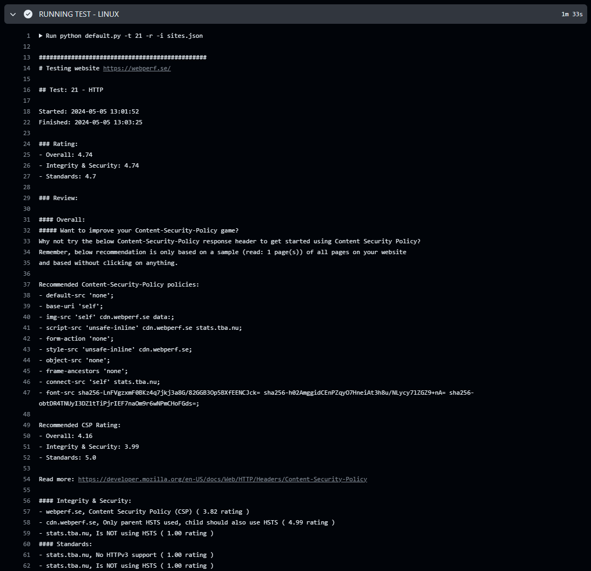
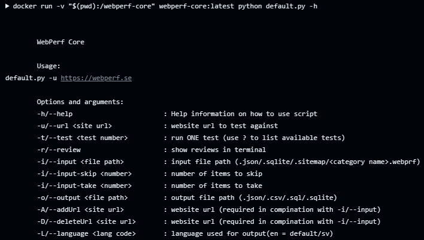

# webperf_core

Welcome to `webperf_core`, your go-to open-source testing suite designed to elevate your web presence. Our mission is to make web improvement an ongoing journey, guiding you step-by-step in optimizing your website across various crucial aspects.

## Features

- **Comprehensive Tests**: Run extensive tests to ensure your website meets fundamental standards and best-practice in security, user integrity, performance, accessibility, SEO, and more.
- **Community-Driven Development**: Benefit from a tool that's continuously improved by a community of web performance, accessibility, security and user integrity enthusiasts. Stay up-to-date with the latest best practices in web development.
- **Production Pipeline Integration**: Seamlessly integrate `webperf_core` into your production pipeline. Validate new releases with confidence before production deployment.
- **Continuous Monitoring**: Set up regular tests for continuous monitoring of your website's performance. Stay informed about any changes and potential areas of improvement.
- **Run same test(s) used by [WebPerf.se](https://webperf.se/)** without [WebPerf Premium](https://webperf.se/erbjudande/)

## Getting Started

`webperf_core` offers flexibility in deployment, catering to both public websites and private pages.
Choose from **GitHub Actions**, **local machine** or **Docker** options to suit your needs best.

[Read more about how to get started](./docs/getting-started.md)

## Contribute to webperf_core

Do you want to contribute?
Join our community of contributors and help shape the future of web performance.
Check out our contribution guidelines and get involved!
We also have a [Slack channel](https://webperf.se/articles/webperf-pa-slack/) where we discuss everything regarding what should be tested, how it is tested and how it should be tested and ofcourse help eachother when someone is stuck.

[Read more about how to contribute](./docs/CONTRIBUTING.md)

## Need help?

It is often worthwhile to google/dockduckgo the error messages you get.
If you give up the search then you can always [check if someone on our Slack channel](https://webperf.se/articles/webperf-pa-slack/) have time to help you,
but don’t forget to paste your error message directly in the first post.
Or, if you think your error are common for more people than yourself, [post an issue here at Github](https://github.com/Webperf-se/webperf_core/issues/new/choose).

# Tests

* [Accessibility (Pa11y)](./docs/tests/pa11y.md)
* [Accessibility (Lighthouse)](./docs/tests/google-lighthouse-a11y.md)
* [Website performance (SiteSpeed)](./docs/tests/sitespeed.md)
* [Website performance (Lighthouse)](./docs/tests/google-lighthouse-performance.md)
* [Best practice on Web (Lighthouse)](./docs/tests/google-lighthouse-best-practice.md)
* [SEO best practise (Lighthouse)](./docs/tests/google-lighthouse-seo.md)
* [Validate 404 page (by default checks for Swedish text, though)](./docs/tests/page-not-found.md)
* [Validate HTML (W3C)](./docs/tests/html.md)
* [Validate CSS (W3C)](./docs/tests/css.md)
* [Security, data-protecting & Integrity (Webbkoll)](./docs/tests/webbkoll.md)
* [Frontend quality (YellowLab Tools)](./docs/tests/yellowlab.md)
* [Energy Efficiency](./docs/tests/energy-efficiency.md)
* [Standard files](./docs/tests/standard.md)
* [HTTP and Network](./docs/tests/http.md)
* [Tracking & Integrity](./docs/tests/tracking.md)
* [Email (Beta)](./docs/tests/email.md)
* [Software (Alpha)](./docs/tests/software.md)
* [Accessibility Statement (Alpha)](./docs/tests/a11y-statement.md)

[Read more about our tests](./docs/tests/README.md) or go directly to a specific test above.

## Third party

Think this is cool and want to see more?
Why not look at third parties.

[Read more about third party](./docs/thirdparty.md)

## Examples

Here are some examples of screenshots that could illustrate how webperf_core works.

### HTTP Test result in GitHub Actions

Here's an example of the review and rating when running HTTP Test against https://webperf.se/ (located in sites.json) directly in GitHub Actions.

### Showing help in Docker

Here's an example showing available options when running docker locally.

